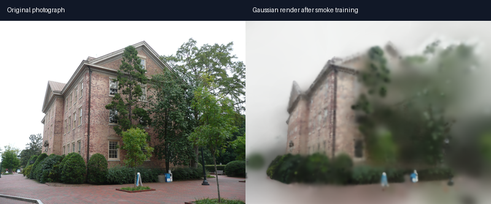
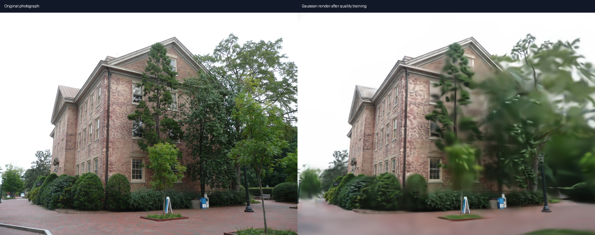
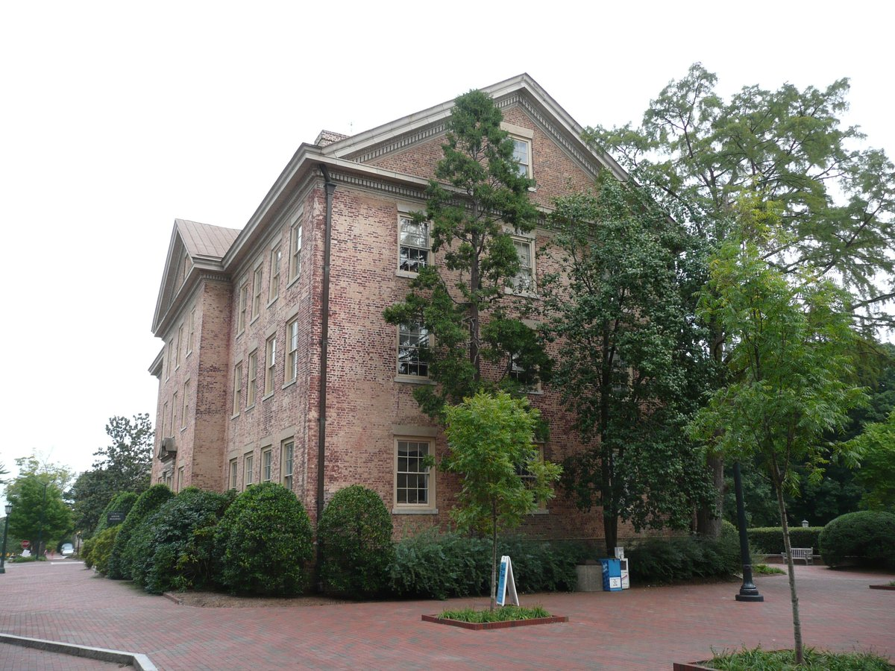
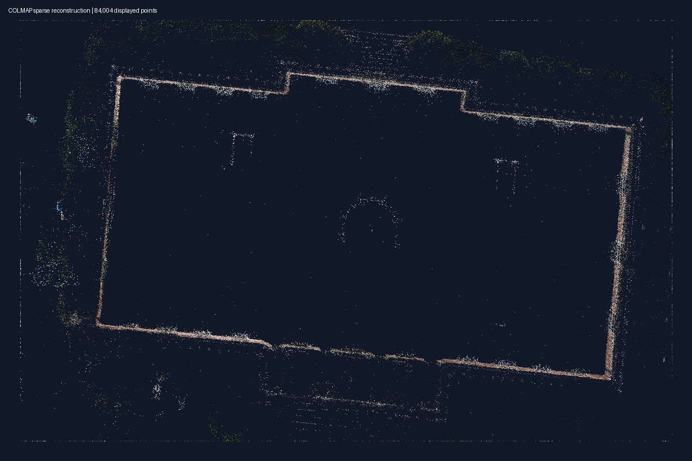

# Capture Studio

Capture Studio is a local photo-to-3D Gaussian Splatting project. Its first
portfolio feature analyzes photographs before training and explains which files
may reduce reconstruction quality.

## Current status

The project has a reproducible Python environment, a verified CUDA-enabled
PyTorch installation, a working gsplat CUDA rasterizer, COLMAP GPU feature
extraction, basic photo-quality analysis, and a verified sparse reconstruction
pipeline. It also has a verified 100-step Gaussian Splatting smoke trainer;
the quality trainer adds Gaussian splitting, duplication, and pruning.

## Setup

The Windows setup currently expects CUDA Toolkit 13.0 and Visual Studio 2022
Build Tools. Install [uv](https://docs.astral.sh/uv/), then run:

```powershell
.\scripts\setup-windows.ps1
.\scripts\install-colmap-windows.ps1
uv run capture-studio check-system
uv run capture-studio check-gpu
uv run capture-studio check-gsplat
uv run capture-studio check-colmap
uv run pytest
```

## Analyze a photo folder

Run the first user-facing feature against the included synthetic example:

```powershell
uv run capture-studio analyze .\examples\photo-analysis\photos
```

The visual comparison is saved at
[`examples/photo-analysis/comparison.png`](examples/photo-analysis/comparison.png).
The analyzer accepts any explicitly selected folder containing JPEG, PNG,
WebP, TIFF, or BMP images.

The report identifies unreadable images, photos below 2 megapixels, possible
blur, and byte-for-byte duplicates. The blur score is calculated at a
consistent maximum size so photographs can be compared more fairly. It is a
screening hint: a low-texture wall can score like a blurry photo even when it
is in focus.

This command currently analyzes files directly inside the selected folder. It
does not analyze videos or nested folders. Near-duplicate viewpoints and camera
coverage will be added after COLMAP reconstruction data is available.

## Run the public reconstruction demo

Download COLMAP's public South Building dataset and reconstruct it:

```powershell
.\scripts\download-demo-data.ps1
uv run capture-studio reconstruct .\data\demo\south-building\images --output .\outputs\demo
```

The download is about 400 MB and contains 128 photographs. Dataset images and
generated outputs stay inside this project but are ignored by Git. The command
refuses to overwrite a non-empty output folder; choose a new output name when
running another reconstruction.

The pipeline runs GPU feature extraction, GPU exhaustive matching, and sparse
camera reconstruction. It saves each stage's log, the original binary COLMAP
model, a readable text model for later training, and a PNG point-cloud preview.

Prepare an undistorted, training-ready copy of the registered photos and camera
model. The 1600-pixel limit balances image detail with GPU memory use:

```powershell
uv run capture-studio prepare-training .\data\demo\south-building\images `
  --model .\outputs\demo\sparse\0 `
  --output .\outputs\demo\3dgs\data `
  --max-image-size 1600
```

This creates resized images plus matching binary and readable COLMAP models
under `outputs\demo\3dgs\data`. Generated training data remains ignored by Git.

Run a short end-to-end Gaussian training test at quarter resolution:

```powershell
uv run capture-studio train-smoke .\outputs\demo\3dgs\data `
  --output .\outputs\demo\3dgs\smoke `
  --steps 100 `
  --image-scale 4
```

The smoke test loads all cameras and sparse points, optimizes the Gaussians on
the CUDA GPU, and saves a checkpoint, metrics, and an original-versus-rendered
comparison. It verifies the training path; it is not the final-quality model.

The verified RTX 5070 Ti run initialized 84,004 Gaussians and reduced the fixed
preview's L1 loss from 0.2281 to 0.0879 in 100 steps:



Run the longer trainer with Gaussian splitting, duplication, and pruning:

```powershell
uv run capture-studio train-quality .\outputs\demo\3dgs\data `
  --output .\outputs\demo\3dgs\quality `
  --steps 1000 `
  --image-scale 2
```

The verified 1,000-step run increased the scene from 84,004 to 109,796
Gaussians and reduced the fixed preview's L1 loss from 0.2325 to 0.0427:



Export the quality checkpoint to a standard Gaussian Splatting PLY:

```powershell
uv run capture-studio export-ply .\outputs\demo\3dgs\quality\checkpoint.pt `
  --output .\outputs\demo\3dgs\quality\model.ply
```

Open the exported model in the local interactive browser viewer:

```powershell
uv run capture-studio view .\outputs\demo\3dgs\quality\model.ply `
  --data .\outputs\demo\3dgs\data
```

The viewer opens at `http://127.0.0.1:8080`. Drag to rotate, scroll to zoom,
and right-drag to move. Keep the command running while viewing; press `Ctrl+C`
in its terminal to stop it. The WebGL Gaussian renderer is provided by
[Viser](https://viser.studio/).

The verified demo registered all 128 images into one camera model, triangulated
84,004 sparse points, and achieved a mean reprojection error of 0.612 pixels.

| One original photograph (`P1180141.JPG`) | Sparse 3D reconstruction result |
| --- | --- |
|  |  |

The colored dots are feature locations matched across multiple photographs and
triangulated in 3D. This is the sparse geometry used to initialize the later
Gaussian Splatting stage, not the finished photorealistic 3DGS.

The images come from COLMAP's official
[South Building sample dataset](https://colmap.github.io/datasets.html). The
project reconstructs the raw images itself and does not reuse the database
included in the download archive.

The setup script loads the C++ compiler and CUDA development headers before
asking `uv` to install the locked dependencies. gsplat is compiled only once;
`uv` caches the resulting package for later installs.

The environment report checks Python, uv, the NVIDIA GPU, PyTorch, the CUDA
compiler, and COLMAP. A `[MISSING]` result tells us what a later setup step must
install; it does not mean the diagnostic command failed.

`check-gpu` asks PyTorch to perform a known matrix multiplication on the CUDA
device and checks the result. This proves more than detecting the graphics card:
it verifies that this project's PyTorch build can execute work on the GPU.

`check-gsplat` goes one step further. It renders one synthetic 3D Gaussian into
a 64 by 64 image, checks that the Gaussian is visible, and runs
backpropagation. A passing result proves that both rendering and the gradient
calculation needed for training work on the GPU.

`check-colmap` generates a temporary textured image and asks COLMAP to extract
SIFT features with GPU 0. It then checks the generated database contains real
features. COLMAP supplies the camera positions that training needs; gsplat uses
those camera positions to optimize and render the Gaussian scene.

The project uses Python 3.10, PyTorch 2.10, and the CUDA 13.0 PyTorch runtime to
match a combination covered by gsplat's current Windows build matrix.

gsplat is pinned to commit `2b902ff` and built with its core 3DGS module only.
The current upstream head contains a Windows CUDA 13 compiler regression in a
new spherical-harmonics kernel. Optional 2DGS, 3DGUT, and experimental rendering
modules are outside this project's scope and are disabled.

The COLMAP installer uses the official CUDA-enabled Windows archive for version
4.2.0 and verifies its published SHA-256 digest before installing it under the
current user's local Programs folder.
